# Stockpile Breach - DFIR CTF Writeup

## Executive Summary

This Digital Forensics and Incident Response (DFIR) investigation examined a compromised workstation belonging to **Khaled Allam**, an employee in the Finance department at EZ-CERT. The attack chain began with a social engineering-themed download and concluded with the establishment of a persistent Command and Control (C2) channel using the **Sliver** framework.

> [!CAUTION]
> This incident demonstrates a classic "Trojanized Application" attack vector targeting finance employees with fake stock monitoring software.

---

## Incident Timeline

```mermaid
gantt
    title Attack Timeline (2025-02-07 UTC)
    dateFormat HH:mm:ss
    axisFormat %H:%M:%S
    
    section Initial Access
    Malware Downloaded           :done, 04:37:06, 1s
    
    section Execution
    Malware Executed             :done, 04:41:24, 1s
    C2 Connection Established    :done, 04:41:24, 3s
    
    section Reconnaissance
    whoami command               :done, 04:41:35, 1s
    
    section Persistence
    File Copied to Temp          :done, 04:43:51, 1s
    Registry Key Added           :done, 04:45:03, 1s
```



---

## Phase 1: Initial Access and Execution

### Attack Vector Analysis

The incident began when the victim downloaded a malicious application masquerading as a legitimate stock monitoring utility. The attacker leveraged social engineering, targeting a Finance department employee with a convincing domain name.

| Attribute | Value |
|-----------|-------|
| **Source Domain** | `app.finance.com` |
| **Malicious File** | `monitorStock.exe` |
| **Download Timestamp** | `2025-02-07 04:37:06 UTC` |
| **Download Location** | `C:\Users\khaled.allam\Downloads\` |
| **Browser Used** | Microsoft Edge |

### File Creation Evidence (Sysmon Event ID 11)

```
SystemTime: 2025-02-07 04:37:26.366516+00:00
UtcTime: 2025-02-07 04:37:26.365
Image: C:\Program Files (x86)\Microsoft\Edge\Application\msedge.exe
TargetFilename: C:\Users\khaled.allam\Downloads\monitorStock.exe
```

### Zone.Identifier (Mark of the Web)

The downloaded file retained its Zone.Identifier, confirming it was downloaded from the internet:

```
[ZoneTransfer]
ZoneId=3
ReferrerUrl=http://app.finance.com/
HostUrl=http://app.finance.com/monitorStock.exe
```

> [!NOTE]
> ZoneId=3 indicates the file was downloaded from the Internet zone, which should have triggered SmartScreen warnings.

### Execution Evidence (Sysmon Event ID 1)

Khaled manually executed the binary from his Downloads folder approximately 4 minutes after download:

| Attribute | Value |
|-----------|-------|
| **Execution Timestamp** | `2025-02-07 04:41:24 UTC` |
| **Process Image** | `C:\Users\khaled.allam\Downloads\monitorStock.exe` |
| **Parent Process** | `C:\Program Files (x86)\Microsoft\Edge\Application\msedge.exe` |
| **User Context** | `EZ-CERT\khaled.allam` |
| **Integrity Level** | Medium |

### Malware Indicators

| Hash Type | Value |
|-----------|-------|
| **SHA256** | `314AA91A2AD7770F67BF43897996A54042E35B6373AE5D6FEB81E03A077255A7` |
| **MD5** | `A95672C643FB8521FAB9B7CAE1366F7E` |
| **IMPHASH** | `F0EA7B7844BBC5BFA9BB32EFDCEA957C` |

---

## Phase 2: Command and Control (C2)

### Network Connection Analysis

Upon execution, the malware immediately established a network connection to an external Command and Control server. The connection characteristics and behavioral patterns identified the framework as **Sliver**.

| Attribute | Value |
|-----------|-------|
| **C2 Server IP** | `3.121.219.28` |
| **C2 Port** | `8888` |
| **C2 Hostname** | `app.finance.com` |
| **Source IP** | `192.168.45.128` |
| **Framework** | Sliver |

### Network Connection Evidence (Sysmon Event ID 3)

```xml
<Event>
  <EventData>
    <Data Name="Image">C:\Users\khaled.allam\Downloads\monitorStock.exe</Data>
    <Data Name="DestinationIp">3.121.219.28</Data>
    <Data Name="DestinationPort">8888</Data>
    <Data Name="DestinationHostname">app.finance.com</Data>
  </EventData>
</Event>
```

### Initial Reconnaissance

The attacker immediately executed the `whoami` command to verify the current user's privileges and identity within the compromised system. This is a standard first step in post-exploitation enumeration.

```
First Command Executed: whoami
Purpose: User privilege verification
```

> [!IMPORTANT]
> The presence of `WHOAMI.EXE-9D378AFE.pf` in the Prefetch folder confirms this command was executed during the attack window.

---

## Phase 3: Persistence and Defense Evasion

### File Relocation

To ensure continued access and evade detection, the attacker moved the malicious binary from the user's Downloads folder to the Windows Temp directory:

| Attribute | Value |
|-----------|-------|
| **Source Path** | `C:\Users\khaled.allam\Downloads\monitorStock.exe` |
| **Destination Path** | `C:\Windows\Temp\monitorStock.exe` |
| **Copy Timestamp** | `2025-02-07 04:43:51 UTC` |
| **Copy Method** | PowerShell |

### File Creation Evidence (Sysmon Event ID 11)

```
SystemTime: 2025-02-07 04:43:51.962429+00:00
UtcTime: 2025-02-07 04:43:51.961
Image: C:\Windows\System32\WindowsPowerShell\v1.0\powershell.exe
TargetFilename: C:\Windows\Temp\monitorStock.exe
```

### Registry Persistence (MITRE ATT&CK T1547.001)

The attacker established persistence by adding a registry value to the standard Windows "Run" key, ensuring the malware starts automatically at user logon.

| Attribute | Value |
|-----------|-------|
| **Registry Key** | `HKCU\Software\Microsoft\Windows\CurrentVersion\Run` |
| **Value Name** | `FilePersistence` |
| **Value Data** | `C:\Windows\Temp\monitorStock.exe` |
| **Persistence Timestamp** | `2025-02-07 04:45:03 UTC` |

### Registry Modification Command

```cmd
"C:\Windows\system32\reg.exe" add HKCU\Software\Microsoft\Windows\CurrentVersion\Run /v FilePersistence /t REG_SZ /d C:\Windows\Temp\monitorStock.exe /f
```

### Registry Modification Evidence (Sysmon Event ID 13)

```
RuleName: T1060,RunKey
EventType: SetValue
UtcTime: 2025-02-07 04:45:03.321
Image: C:\Windows\system32\reg.exe
TargetObject: HKU\S-1-5-21-593536282-824182100-2440914132-1000\SOFTWARE\Microsoft\Windows\CurrentVersion\Run\FilePersistence
Details: C:\Windows\Temp\monitorStock.exe
```

---

## Attack Chain Visualization

```mermaid
flowchart TD
    A[👤 Victim: Khaled Allam<br/>Finance Department] --> B[🌐 Visits app.finance.com]
    B --> C[📥 Downloads monitorStock.exe<br/>04:37:06 UTC]
    C --> D[▶️ Executes Malware<br/>04:41:24 UTC]
    D --> E[🔗 C2 Connection Established<br/>3.121.219.28:8888]
    E --> F[🔍 Reconnaissance<br/>whoami command]
    F --> G[📁 File Copied to Temp<br/>04:43:51 UTC]
    G --> H[🔑 Registry Persistence Added<br/>04:45:03 UTC]
    H --> I[⚠️ Persistent Access Achieved]
    
    style A fill:#e74c3c,color:#fff
    style I fill:#c0392b,color:#fff
    style E fill:#f39c12,color:#fff
```



---

## Technical Artifacts Reference

### Complete IOC Table

| Artifact Category | Value/Detail |
|-------------------|--------------|
| **Malware Name** | `monitorStock.exe` |
| **SHA256 Hash** | `314AA91A2AD7770F67BF43897996A54042E35B6373AE5D6FEB81E03A077255A7` |
| **MD5 Hash** | `A95672C643FB8521FAB9B7CAE1366F7E` |
| **IMPHASH** | `F0EA7B7844BBC5BFA9BB32EFDCEA957C` |
| **C2 Framework** | Sliver |
| **C2 Address** | `3.121.219.28:8888` |
| **C2 Domain** | `app.finance.com` |
| **Persistence Key** | `HKCU\Software\Microsoft\Windows\CurrentVersion\Run` |
| **Persistence Value** | `FilePersistence` |
| **First Command** | `whoami` |
| **Victim User** | `EZ-CERT\khaled.allam` |
| **Victim Machine** | `EZ-CERT` |

### Timeline Summary

| Timestamp (UTC) | Event |
|-----------------|-------|
| `2025-02-07 04:37:06` | Malware downloaded from app.finance.com |
| `2025-02-07 04:41:24` | Malware executed by user |
| `2025-02-07 04:41:24` | C2 connection established |
| `2025-02-07 04:41:35` | Initial reconnaissance (whoami) |
| `2025-02-07 04:43:51` | Malware copied to C:\Windows\Temp\ |
| `2025-02-07 04:45:03` | Registry persistence established |

### Prefetch Evidence

The following Prefetch files confirm execution of attacker tools:

- `MONITORSTOCK.EXE-0F7B9B9D.pf`
- `MONITORSTOCK.EXE-4D4C5193.pf`
- `WHOAMI.EXE-9D378AFE.pf`
- `REG.EXE-A93A1343.pf`
- `POWERSHELL.EXE-CA1AE517.pf`

---

## MITRE ATT&CK Mapping

| Tactic | Technique | ID | Description |
|--------|-----------|-----|-------------|
| Initial Access | Phishing | T1566 | User downloaded malware from fake domain |
| Execution | User Execution | T1204.002 | Victim manually executed malicious binary |
| Persistence | Boot/Logon Autostart | T1547.001 | Registry Run key modification |
| Defense Evasion | Masquerading | T1036 | Malware disguised as stock monitoring tool |
| Discovery | System Owner/User Discovery | T1033 | whoami command execution |
| Command and Control | Application Layer Protocol | T1071 | Sliver C2 over HTTP/HTTPS |

---

## Recommendations

### Immediate Actions

1. **Isolate** the affected workstation from the network
2. **Block** the C2 IP `3.121.219.28` at the perimeter firewall
3. **Block** the domain `app.finance.com` in DNS/proxy
4. **Remove** the persistence registry key
5. **Delete** the malware from `C:\Windows\Temp\monitorStock.exe`
6. **Reset** credentials for user `khaled.allam`

### Long-term Remediation

1. Implement application whitelisting
2. Enable Windows Defender Attack Surface Reduction (ASR) rules
3. Deploy EDR solution with behavioral detection
4. Conduct security awareness training focusing on social engineering
5. Review network segmentation for finance department

---

## Conclusion

This incident represents a successful social engineering attack targeting a finance department employee. The attacker leveraged a convincing domain (`app.finance.com`) and a legitimate-sounding application name (`monitorStock.exe`) to trick the victim into downloading and executing malware.

The attack chain followed a classic pattern:
1. **Initial Access** via trojanized application
2. **Execution** through user interaction
3. **C2 Establishment** using Sliver framework
4. **Persistence** via Registry Run key

The approximately 8-minute window between download (04:37:06) and persistence establishment (04:45:03) indicates an automated or operator-assisted implant deployment, characteristic of the Sliver C2 framework.

---

## CTF Challenge Answers

| Question | Answer |
|----------|--------|
| Q1: Domain of downloaded app | `app.finance.com` |
| Q2: Download timestamp | `2025-02-07 04:37:06 UTC` |
| Q3: Execution timestamp | `2025-02-07 04:41:24 UTC` |
| Q4: SHA256 hash | `314AA91A2AD7770F67BF43897996A54042E35B6373AE5D6FEB81E03A077255A7` |
| Q5: C2 IP:Port | `3.121.219.28:8888` |
| Q6: First command | `whoami` |
| Q7: Registry key | `Software\Microsoft\Windows\CurrentVersion\Run` |
| Q8: Registry value | `C:\Windows\Temp\monitorStock.exe` |
| Q9: File copy timestamp | `2025-02-07 04:43:51 UTC` |
| Q10: Persistence timestamp | `2025-02-07 04:45:03 UTC` |
| Q11: C2 Framework | `Sliver` |

---

**Report Generated:** 2026-01-23  
**Analyst:** Antigravity AI Assistant  
**Classification:** CTF Challenge Writeup
